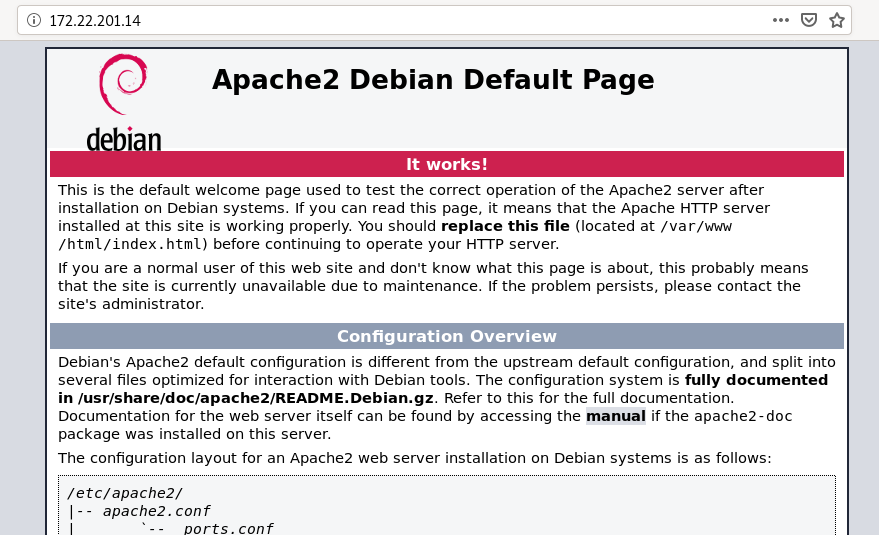

# Ejercicio1: Implementación de un cortafuego personal
Vamos a realizar los primeros pasos para implementar un cortafuegos en un nodo de una red, aquel que se ejecuta en el propio equipo que trata de proteger, lo que a veces se denomina un cortafuegos personal.

## Esquema de red
Vamos a utilizar una máquina en openstack, que vamos a crear con la receta heat: escenario1.yaml. La receta heat ha deshabilitado el cortafuego que nos ofrece openstack (todos los puertos de todos los protocolos están abiertos). La máquina creada tendrá un servidor web instalado. Vamos a trabajar con la red de las ips flotantes: 172.22.0.0/16.

## Limpieza de las reglas previas
~~~
iptables -F
iptables -t nat -F
iptables -Z
iptables -t nat -Z
~~~

Lista reglas de iptable:
~~~
root@maquina:/home/debian# iptables -L -nv
Chain INPUT (policy ACCEPT 53 packets, 3780 bytes)
 pkts bytes target     prot opt in     out     source               destination         

Chain FORWARD (policy ACCEPT 0 packets, 0 bytes)
 pkts bytes target     prot opt in     out     source               destination         

Chain OUTPUT (policy ACCEPT 31 packets, 2904 bytes)
 pkts bytes target     prot opt in     out     source               destination  
 ~~~

## Vamos a permitir ssh

Cómo estamos conectado a la máquina por ssh, vamos a permitir la conexión ssh desde la red 172.22.0.0/16, antes de cambiar las políticas por defecto a DROP, para no perder la conexión:
~~~
iptables -A INPUT -s 172.22.0.0/16 -p tcp --dport 22 -j ACCEPT
iptables -A OUTPUT -d 172.22.0.0/16 -p tcp --sport 22 -j ACCEPT
iptables -A INPUT -s 172.23.0.0/16 -p tcp --dport 22 -j ACCEPT
iptables -A OUTPUT -d 172.23.0.0/16 -p tcp --sport 22 -j ACCEPT
~~~

Lista prueba iptable:
~~~
root@maquina:/home/debian# iptables -L -nv
Chain INPUT (policy ACCEPT 73 packets, 5032 bytes)
 pkts bytes target     prot opt in     out     source               destination         
   10   744 ACCEPT     tcp  --  *      *       172.22.0.0/16        0.0.0.0/0            tcp dpt:22

Chain FORWARD (policy ACCEPT 0 packets, 0 bytes)
 pkts bytes target     prot opt in     out     source               destination         

Chain OUTPUT (policy ACCEPT 52 packets, 5420 bytes)
 pkts bytes target     prot opt in     out     source               destination         
    3   312 ACCEPT     tcp  --  *      *       0.0.0.0/0            172.22.0.0/16        tcp spt:22
~~~

# Política por defecto
~~~
iptables -P INPUT DROP
iptables -P OUTPUT DROP
~~~

Lista prueba iptable:
~~~
root@maquina:/home/debian# iptables -L -nv
Chain INPUT (policy DROP 73 packets, 5032 bytes)
 pkts bytes target     prot opt in     out     source               destination         
   84  5500 ACCEPT     tcp  --  *      *       172.22.0.0/16        0.0.0.0/0            tcp dpt:22

Chain FORWARD (policy ACCEPT 0 packets, 0 bytes)
 pkts bytes target     prot opt in     out     source               destination         

Chain OUTPUT (policy DROP 53 packets, 5496 bytes)
 pkts bytes target     prot opt in     out     source               destination         
   59  7316 ACCEPT     tcp  --  *      *       0.0.0.0/0            172.22.0.0/16        tcp spt:22
~~~

Ping al loopback:
~~~
root@maquina:/home/debian# ping 127.0.0.1
PING 127.0.0.1 (127.0.0.1) 56(84) bytes of data.
ping: sendmsg: Operation not permitted
ping: sendmsg: Operation not permitted
ping: sendmsg: Operation not permitted
^C
--- 127.0.0.1 ping statistics ---
3 packets transmitted, 0 received, 100% packet loss, time 32ms
~~~

Ping al exterior:
~~~
root@maquina:/home/debian# ping 8.8.8.8
PING 8.8.8.8 (8.8.8.8) 56(84) bytes of data.
ping: sendmsg: Operation not permitted
ping: sendmsg: Operation not permitted
ping: sendmsg: Operation not permitted
^C
--- 8.8.8.8 ping statistics ---
3 packets transmitted, 0 received, 100% packet loss, time 45ms
~~~
Comprobamos que el equipo no puede acceder a ningún servicio ni de Internet ni de la red local, ya que la política lo impide.

## Permitimos tráfico para la interfaz loopback
~~~
iptables -A INPUT -i lo -p icmp -j ACCEPT
iptables -A OUTPUT -o lo -p icmp -j ACCEPT
~~~

Ping a loopback:
~~~
root@maquina:/home/debian# ping 127.0.0.1
PING 127.0.0.1 (127.0.0.1) 56(84) bytes of data.
64 bytes from 127.0.0.1: icmp_seq=1 ttl=64 time=0.045 ms
64 bytes from 127.0.0.1: icmp_seq=2 ttl=64 time=0.077 ms
^C
--- 127.0.0.1 ping statistics ---
2 packets transmitted, 2 received, 0% packet loss, time 14ms
rtt min/avg/max/mdev = 0.045/0.061/0.077/0.016 ms
~~~

## Peticiones y respuestas protocolo ICMP
~~~
iptables -A INPUT -i eth0 -p icmp -j ACCEPT
iptables -A OUTPUT -o eth0 -p icmp -j ACCEPT
~~~

Comprobamos su funcionamiento haciendo ping a una IP pública:
~~~
root@maquina:/home/debian# ping 1.1.1.1
PING 1.1.1.1 (1.1.1.1) 56(84) bytes of data.
64 bytes from 1.1.1.1: icmp_seq=1 ttl=54 time=42.2 ms
^C
--- 1.1.1.1 ping statistics ---
1 packets transmitted, 1 received, 0% packet loss, time 0ms
rtt min/avg/max/mdev = 42.248/42.248/42.248/0.000 ms
~~~

## Consultas y respuestas DNS
~~~
iptables -A OUTPUT -o eth0 -p udp --dport 53 -j ACCEPT
iptables -A INPUT -i eth0 -p udp --sport 53 -j ACCEPT
~~~

Comprobamos su funcionamiento con una consulta DNS:
~~~
root@maquina:/home/debian# dig @1.1.1.1 www.josedomingo.org

; <<>> DiG 9.11.5-P4-5.1-Debian <<>> @1.1.1.1 www.josedomingo.org
; (1 server found)
;; global options: +cmd
;; Got answer:
;; ->>HEADER<<- opcode: QUERY, status: NOERROR, id: 1185
;; flags: qr rd ra; QUERY: 1, ANSWER: 2, AUTHORITY: 0, ADDITIONAL: 1

;; OPT PSEUDOSECTION:
; EDNS: version: 0, flags:; udp: 1452
;; QUESTION SECTION:
;www.josedomingo.org.		IN	A

;; ANSWER SECTION:
www.josedomingo.org.	67	IN	CNAME	playerone.josedomingo.org.
playerone.josedomingo.org. 67	IN	A	137.74.161.90

;; Query time: 478 msec
;; SERVER: 1.1.1.1#53(1.1.1.1)
;; WHEN: Tue Nov 19 11:07:44 UTC 2019
;; MSG SIZE  rcvd: 88
~~~

## Tráfico http (que la máquina pueda navegar)
~~~
iptables -A OUTPUT -o eth0 -p tcp --dport 80 -j ACCEPT
iptables -A INPUT -i eth0 -p tcp --sport 80 -j ACCEPT
~~~

Comprobamos que funciona accediendo a un servicio http (! no https)
~~~
root@maquina:/home/debian# curl http://portquiz.net:80
Port 80 test successful!
Your IP: 158.99.1.24
~~~

## Tráfico https
~~~
iptables -A OUTPUT -o eth0 -p tcp --dport 443 -j ACCEPT
iptables -A INPUT -i eth0 -p tcp --sport 443 -j ACCEPT
~~~

Comprobamos que funciona abriendo un navegador y accediendo a cualquier sitio web (hoy en día la mayoría son https).
~~~
root@maquina:/home/debian# curl http://portquiz.net:443
Port 443 test successful!
Your IP: 158.99.1.24
~~~

## Permitimos el acceso a nuestro servidor web
~~~
iptables -A OUTPUT -o eth0 -p tcp --sport 80 -j ACCEPT
iptables -A INPUT -i eth0 -p tcp --dport 80 -j ACCEPT
~~~

Se restaura Apache:
~~~
root@maquina:/home/debian# systemctl restart apache2.service
~~~

## Configuración en un solo paso

Editamos un fichero y añadimos todas las reglas anteriores:
~~~
# Limpiamos las tablas
iptables -F
iptables -t nat -F
iptables -Z
iptables -t nat -Z
# Establecemos la política
iptables -P INPUT DROP
iptables -P OUTPUT DROP

iptables -A INPUT -i lo -p icmp -j ACCEPT
iptables -A OUTPUT -o lo -p icmp -j ACCEPT

iptables -A INPUT -s 172.22.0.0/16 -p tcp --dport 22 -j ACCEPT
iptables -A OUTPUT -d 172.22.0.0/16 -p tcp --sport 22 -j ACCEPT

iptables -A OUTPUT -o eth0 -p icmp -j ACCEPT
iptables -A INPUT -i eth0 -p icmp -j ACCEPT

iptables -A OUTPUT -o eth0 -p udp --dport 53 -j ACCEPT
iptables -A INPUT -i eth0 -p udp --sport 53 -j ACCEPT

iptables -A OUTPUT -o eth0 -p tcp --dport 80 -j ACCEPT
iptables -A INPUT -i eth0 -p tcp --sport 80 -j ACCEPT

iptables -A OUTPUT -o eth0 -p tcp --dport 443 -j ACCEPT
iptables -A INPUT -i eth0 -p tcp --sport 443 -j ACCEPT

iptables -A OUTPUT -o eth0 -p tcp --sport 80 -j ACCEPT
iptables -A INPUT -i eth0 -p tcp --dport 80 -j ACCEPT
~~~

# Ejercicios
**1. Permite poder hacer conexiones ssh al exterior.**
~~~
root@maquina:/home/debian# iptables -A OUTPUT -o eth0 -p tcp --sport 22 -j ACCEPT
root@maquina:/home/debian# iptables -A INPUT -i eth0 -p tcp --sport 22 -j ACCEPT
~~~

~~~
debian@maquina:~$ ssh paloma@172.22.7.88
The authenticity of host '172.22.7.88 (172.22.7.88)' can't be established.
ECDSA key fingerprint is SHA256:TMp5TPIjjKNSGQrf1jUMXXOo36syVo4Uf54L4QKdAIM.
Are you sure you want to continue connecting (yes/no)? yes
Warning: Permanently added '172.22.7.88' (ECDSA) to the list of known hosts.
paloma@172.22.7.88's password: 
Linux coatlicue 4.19.0-6-amd64 #1 SMP Debian 4.19.67-2+deb10u2 (2019-11-11) x86_64

The programs included with the Debian GNU/Linux system are free software;
the exact distribution terms for each program are described in the
individual files in /usr/share/doc/*/copyright.

Debian GNU/Linux comes with ABSOLUTELY NO WARRANTY, to the extent
permitted by applicable law.
You have mail.
Last login: Wed Nov 13 12:29:22 2019
paloma@coatlicue:~$ 
~~~

**2. Deniega el acceso a tu servidor web desde una ip concreta.**

iptables -I INPUT -i eth0 -p tcp --dport 80 -d  172.22.7.88 -j DROP

iptables -I OUTPUT -o eth0 -p tcp --sport 80 -s 172.22.7.88 -j DROP

~~~
root@maquina:/home/debian# iptables -I INPUT -p tcp --dport 80 -d  172.22.7.88 -j DROP
root@maquina:/home/debian# iptables -I OUTPUT -p tcp --sport 80 -s 172.22.7.88 -j DROP
root@maquina:/home/debian# iptables -I OUTPUT -p tcp --sport 443 -s 172.22.7.88 -j DROP
root@maquina:/home/debian# iptables -I INPUT -p tcp --dport 443 -d  172.22.7.88 -j DROP
~~~

**3. Permite hacer consultas DNS sólo al servidor 192.168.202.2. Comprueba que no puedes hacer un dig @1.1.1.1.**

Primero hay que eliminar la regla que lo acepta todo:
~~~
iptables -D INPUT 7
iptables -D OUTPUT 7
~~~

Y se añade la siguiente regla para que solo permita a la ip correspondiente:
~~~
iptables -A OUTPUT -o eth0 -p udp --dport 53 -d 192.168.202.2 -j ACCEPT
iptables -A INPUT -i eth0 -p udp --sport 53 -s 192.168.202.2 -j ACCEPT
~~~

**4. No permitir el acceso al servidor web de www.josedomingo.org (Tienes que utilizar la ip). ¿Puedes acceder a fp.josedomingo.org?**
************VOY POR AQUÍ
137.74.161.90
---probar si es esto
iptables -I INPUT -i eth0 -p tcp --dport 443 -s 137.74.161.90 -j DROP

iptables -I OUTPUT -o eth0 -p tcp --sport 443 -d  137.74.161.90 -j DROP

iptables -I INPUT -i eth0 -p tcp --dport 80 -d  172.22.7.88 -j DROP

iptables -I OUTPUT -o eth0 -p tcp --sport 80 -s 172.22.7.88 -j DROP

**5. Permite mandar un correo usando nuestro servidor de correo: babuino-smtp. Para probarlo ejecuta un telnet bubuino-smtp.gonzalonazareno.org 25.**

**6. Instala un servidor mariadb, y permite los accesos desde la ip de tu cliente. Comprueba que desde otro cliente no se puede acceder.**
